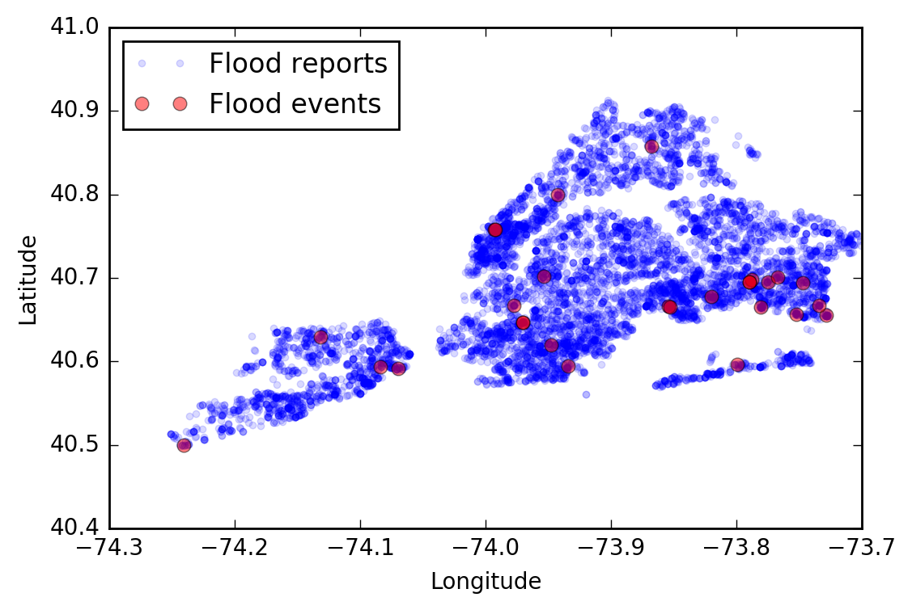

Visionmaker NYC is a web-based, user-friendly, environmental modeling system for New York City (NYC) created by the Wildlife Conservation Society (WCS). The website allows users to choose a climate scenario, quality of life and precipitation events as parameters, collectively referred to as a “Vision” for the city. The model then predicts water consumption, biodiversity, greenhouse gas emission and sustainable population for a selected section of NYC. Users can then change the ecosystems and land uses present in their chosen geographical area.
Here, we empirically evaluate the floodwater component of the hydrological model used in Visionmaker NYC against observed flooding. Using reports from the NYC 311 help phone line, where residents frequently call to report hazardous or nuisance conditions and request services from the city, we generate a conservative estimate of when and where in NYC flooding occurred 2015. Daily historical weather data was used to estimate the quantity of  precipitation causing each flood. This precipitation was then modelled in Visionmaker NYC and prediction produced for the area with reported flooding.

Methods
=======
Throughout this report, file names will be referenced as `file/name/here`. The corresponding files can be found hosted on [Github](https://github.com/jpeacock29/Visionmaker-hydrological-validation)[^github].

Mining 311 data for flooding events
-----------------------------------
Data on 311 reports from 2015 was obtained from NYC Open Data portal.[^data] Using the python programming language, the reports were filtered for those with (1) the word “flood” in the “Descriptor” field, (2) a “Complaint Type” of “Sewer” and (3) a provided longitude and latitude. Of the ~2.3 million reports, 9189 fitting this criteria were selected.

From these 9189 reports of flooding, we identified "storm periods" as consecutive days of the year with more than 50 reports of flooding. This threshold was chosen heuristically to include most of the peaks observed in Fig 1. For each of these 19 storm periods, we identified geospatial clusters of flooding reports where several reports of flooding were made in close proximity as “flood events”. We applied the DB-SCAN algorithm to perform the clustering using the longitudes and latitudes given in the flood reports.

The DB-SCAN algorithm requires two parameters: $n$, the number of reports required to form a cluster, and $\epsilon$ which, roughly, indicates the maximum distance allowed between reports in the same cluster. We choose these parameters conservatively, erring on the side of caution in order to select only the most likely flooding events. Thus, we required $n = 3$ reports of flooding to form a cluster and corresponding to approximately 0.25 miles as the maximum distance between reports in a cluster. The clusters include only those reports that appeared close together; many others are classified as “outlier” points by the DB-SCAN algorithm and ignored in further analysis.

Lastly, we note that the clustering algorithm applied Euclidean distance to the longitudes and latitudes of the reports and imparts a slight distortion. (Specifically, while 1 degree of latitude is 69 statutory miles, 1 degree of longitude is ~53 statutory miles at the latitude of NYC. Thus reports separated by 1 degree of longitude are actually closer together than those separated by 1 degree of latitude; however, the algorithm would treat the points as the same distance apart.) Since we are dealing with a relatively small area far from the poles, this distortion likely negligibly affects the results of the clustering and our later analysis. To correct this, we might use the Vincenty distance during clustering.

This analysis can be reproduced by running `make.sh`. Note that the DB-SCAN algorithm is non-deterministic and may not produce exactly the same results in each run.

Precipitation data
------------------
Daily precipitation data was obtained from the Northeast Regional Climate Center using the Central Park weather station.[^3] Precipitation is given in inches of rainfall and liquid equivalent of snowfall. For each of the flooding events identified in the 311 data, we summed the reported precipitation for each day spanned by the flood event (column `central_park_daily_precipitation_inches` of `Visionmaker_modelling_results/ Visionmaker_flood_predictions.csv`).

Modelling in Visionmaker NYC
----------------------------
For each flooding event, the aggregated precipitation was used to model the flooded area in Visionmaker NYC. Flooding events were modelled in Visionmaker NYC using the “ESW-NYC” account as follows:[^4]

1. After opening Visionmaker NYC and logging in, follow the menus and buttons: Manage > Visions > + Create New Vision. Visions were named as `test_` followed by the `flood_id` number in `Visionmaker_modelling_results/ Visionmaker_flood_predictions.csv`. No additional parameters were set and the default “Base on” value of “New York City (2014)” was kept.
2. Since the flooding events are marked by longitude and latitude, but Visionmaker NYC does not provide a search functionality for longitude and latitude, Google Maps was used to assist in locating flooding events. Once zoomed to the appropriate level (17), the geographic area of the Vision is defined as the blocks surrounding the specified longitude and latitude and the Vision is saved.
3. The aggregated precipitation of the flooding event is next converted to the appropriate Visionmaker NYC parameters. Internally, the Visionmaker NYC model uses the product of two parameters, storm duration and storm intensity, to determine the total precipitation of a storm. Since Visionmaker NYC uses a “bucket model” in determining floodwater output, only this total precipitation affects the results.[^5] Externally, these two parameters are determined by two broader parameters, “Climate” and “Precipitation Event”. The Visionmaker NYC parameters used for each flood event and the total precipitation are found in columns `visionmaker_precipitation_event`, `visionmaker_climate` and `visionmaker_total_precipitation`, respectively, of `Visionmaker_flood_predictions.csv`. These values were selected with the aide of a table relating each combination of “Climate” and “Precipitation Event” to the corresponding total precipitation[^6] and chosen to closely follow the observed precipitation.
4. After inputting the appropriate values for the “Climate” and “Precipitation Event”, under “Environmental Performance” section “Water”, the value “Floodwater” is selected from the drop-down menu. The displayed value is reported in column `visionmaker_floodwater` of `Visionmaker_flood_predictions.csv`.

Results and Discussion
======================
Using the 311 data, 26 flood events were identified (`Outputs_1/311_2015_floods.csv`). As a sanity check, we observe that almost all flood events identified occurred during periods of significant observed precipitation in the historical weather record.  Furthermore, flood events often overlap geographically (Fig 1), having flooded during multiple storm events, as might be expected of a low-lying area prone to flooding. Elevation data might also be considered in the future to further validate the identified flood events. These checks give us some assurance that our identified flood events are plausible.

Using the 311 data, 26 flood events were identified (`Outputs_1/311_2015_floods.csv`). As a sanity check, we observe that almost all flood events identified occurred during periods of significant observed precipitation in the historical weather record.  Furthermore, flood events often overlap geographically (Fig 1), having flooded during multiple storm events, as might be expected of a low-lying area prone to flooding. Elevation data might also be considered in the future to further validate the identified flood events. These checks give us some assurance that our identified flood events are plausible.

Of the 26 flood events, we modeled a sample of 10 in Visionmaker, specifically choosing those with the highest precipitation. The Visionmaker NYC model did not predict flooding at any of the reported sites under the observed conditions.

    - Margin of error, since floods may occur through mechanisms outside the model, like trash clogging a drainway or pipe bursts. However, we would expect this to be only a fraction of the floods.
    - Since the bucket model is used, there is no time dependence. Nuisance flooding, as we've tested here, is generally a transient phenomena, likely occurring only during brief periods of intense precipitation. The generally brief durations of reported floods weakly support this notion. This might best account for the disagreement of prediction with observation.

- suggestions
    - allow more precise or direction manipulation of total rainfall in storm events
    - allow search by longitude and latitude
    - The flooding model might be adjusted to include time dependence, for example, by considering a precipitation rate exceeding the drainage rate as a cause of temporary flooding.
    - Consider changing the nomenclature of "floodwaters" since it does not correspond to the common understanding of a flood.
    - Could low sewer volume estimates be to blame?e of 10 in Visionmaker, specifically choosing those with the highest precipitation. The Visionmaker NYC model did not predict flooding at any of the reported sites under the observed conditions.

    - Margin of error, since floods may occur through mechanisms outside the model, like trash clogging a drainway or pipe bursts. However, we would expect this to be only a fraction of the floods.
    - Since the bucket model is used, there is no time dependence. Nuisance flooding, as we've tested here, is generally a transient phenomena, likely occurring only during brief periods of intense precipitation. The generally brief durations of reported floods weakly support this notion. This might best account for the disagreement of prediction with observation.
- suggestions
    - allow more precise or direction manipulation of total rainfall in storm events
    - allow search by longitude and latitude
    - The flooding model might be adjusted to include time dependence, for example, by considering a precipitation rate exceeding the drainage rate as a cause of temporary flooding.
    - Consider changing the nomenclature of "floodwaters" since it does not correspond to the common understanding of a flood.
    - Could low sewer volume estimates be to blame?

[^github]: <https://github.com/jpeacock29/Visionmaker-hydrological-validation>
[^data]: Original data available at <https://data.cityofnewyork.us/dataset/311-Service-Requests-From-2015/57g5-etyj>
[^3]: <http://climodtest.nrcc.cornell.edu/>
[^4]: Password available upon request
[^5]: <https://visionmaker.us/resources/models/water/'> and <https://visionmaker.us/info/metric/27/>
[^6]: `Visionmaker_modelling_results/Visionmaker_storm_parameters.csv`
