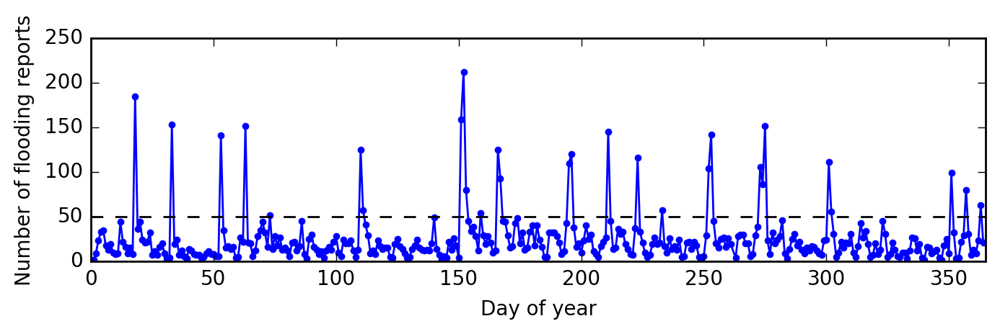

\newpage{}

Introduction
============
Visionmaker NYC[^vision] is a web-based, user-friendly environmental modeling system for New York City (NYC) created by the Wildlife Conservation Society (WCS). To build the model, the user chooses climate scenario, quality of life, precipitation events and land uses as parameters, collectively referred to as a “Vision” for the city. The model then predicts water usage, biodiversity, greenhouse gas emission, sustainable population, among other outputs, for a selected section of NYC. Using this simplistic model, the user can gain a better understanding and appreciation for the dynamics and environment of the city.

Here, we empirically evaluate the floodwater component of the hydrological model contained within Visionmaker NYC against observed flooding. Using reports from the NYC 311 help phone line, where residents frequently call to report hazardous or bothersome conditions and request services from the city, we generate a conservative estimate of when and where in NYC flooding occurred 2015. Daily historical weather data was used to estimate the quantity of precipitation ostensibly causing each flood. This precipitation was then modeled in Visionmaker NYC, producing a predicted volume of flood water. Comparing whether Visionmaker NYC predictions of flooding coincide with known incidences of flooding allows us to test the efficacy of the model.

Methods
=======
Throughout this report, file names will be referenced as `file/name/here.txt` and the corresponding files can be found hosted on Github.[^github]

Mining 311 data for flooding events
-----------------------------------
Data on 311 reports from 2015 was obtained from NYC Open Data portal.[^data] Using the python programming language, the reports were filtered for those with (1) the word “flood” in the “Descriptor” field, (2) a “Complaint Type” of “Sewer” and (3) a provided longitude and latitude. Of the ~2.3 million reports, 9189 fitting this criteria were selected.

From these 9189 reports of flooding, we identified "storm periods" as consecutive days of the year with more than 50 reports of flooding. This threshold was chosen heuristically to include most of the peaks observed in Fig 1. For each of these 19 storm periods, we identified geospatial clusters of flooding reports where several reports of flooding were made in close geographic proximity. We applied the DBSCAN algorithm to perform the clustering using the longitudes and latitudes given in the flood reports. We represent each cluster as a single “flood event” occurring at the average time and location of the flood reports composing the cluster.

This analysis can be reproduced by running `make.sh`. Note that the DBSCAN algorithm is non-deterministic and may not produce exactly the same results in each run.

Details of the DBSCAN algorithm
-------------------------------
The DBSCAN algorithm requires two parameters: $n$, the number of reports required to form a cluster, and $\epsilon$ which, roughly, indicates the maximum distance allowed between reports in the same cluster. We choose these parameters conservatively, erring on the side of caution in order to select only the most likely flooding events. Thus, we required $n = 3$ reports of flooding to form a cluster and $\epsilon$ corresponding to approximately 0.25 miles as the maximum distance between reports in a cluster. The clusters include only those reports that appeared close together; many others are classified as “outlier” points by the DBSCAN algorithm and ignored in further analysis.

Lastly, we note that the clustering algorithm applied Euclidean distance to the longitudes and latitudes of the reports and imparts a slight distortion. (Specifically, while 1 degree of latitude is 69 statutory miles, 1 degree of longitude is ~53 statutory miles at the latitude of NYC. Thus reports separated by 1 degree of longitude are actually closer together than those separated by 1 degree of latitude; however, the algorithm would treat the points as the same distance apart.) Since we are dealing with a relatively small area far from the poles, this distortion likely negligibly affects the results of the clustering and our later analysis. To correct this, we might use the Vincenty distance during clustering.

Cross-referencing daily precipitation
-------------------------------------
Daily precipitation data was obtained from the Northeast Regional Climate Center using the Central Park weather station.[^3] Precipitation is given in inches of rainfall and liquid equivalent of snowfall. For each of the flooding events identified in the 311 data, we summed the reported precipitation for each day spanned by the flood event (column `central_park_daily_precipitation_inches` of `Visionmaker_modelling_results/Visionmaker_flood_predictions.csv`).

Modeling in Visionmaker NYC
----------------------------
For each flooding event, the aggregated precipitation was used to model the flooded area in Visionmaker NYC. Flooding events were modeled in Visionmaker NYC as follows, making reference to the columns of the spreadsheet `Visionmaker_modelling_results/Visionmaker_flood_predictions.csv`:

1. After opening Visionmaker NYC and logging in, follow the menus and buttons: `Manage > Visions > Create New Vision`. Visions were named as `test_` followed by the identifier from column `flood_id`. No additional parameters were set and the default “Base on” value of “New York City (2014)” was retained.

2. Since the flooding events are marked by longitude and latitude, but Visionmaker NYC does not provide a search functionality for longitude and latitude, Google Maps was used to assist in locating flooding events. Once zoomed to the appropriate level (ie, 17), the geographic area of the Vision is defined as the blocks surrounding the specified longitude and latitude and the Vision is saved.[^4]

3. The aggregated precipitation of the flooding event is next converted to the appropriate Visionmaker NYC parameters. Internally, the Visionmaker NYC model uses the product of two parameters, storm duration and storm intensity, to determine the total precipitation of a storm. Since Visionmaker NYC uses a “bucket model” in determining floodwater output, only this total precipitation affects the results.[^5] Externally, these two parameters are determined by two broader parameters, “Climate” and “Precipitation Event”. The Visionmaker NYC parameters used for each flood event and the total precipitation are found in columns `visionmaker_precipitation_event`, `visionmaker_climate` and `visionmaker_total_precipitation`, respectively. These values were selected with the aide of a table relating each combination of “Climate” and “Precipitation Event” to the corresponding total precipitation[^6] and chosen to follow the observed precipitation as closely as possible.

4. After inputting the appropriate values for the “Climate” and “Precipitation Event”, looking in “Environmental Performance” section “Water”, the value “Floodwater” is selected from the drop-down menu. The displayed value is reported in column `visionmaker_floodwater`.

Results & Discussion
====================

Using the 311 data, 26 flood events were identified.[^flood_events] As a sanity check, we observe that almost all flood events identified occurred during periods of significant precipitation in the historical weather record. Furthermore, flood events often overlap geographically (Fig 1), having flooded during multiple storm events, as might be expected of a low-lying area prone to flooding. To further validate our flood events, future work might also consider elevation and topography data where we would expect only low-lying areas to flood. These checks give us some assurance that our identified flood events are plausible.

Of the 26 flood events, we modeled a sample of 10 in Visionmaker, specifically choosing those with the highest precipitation. The Visionmaker NYC model did not predict flooding at any of the flood events under the observed precipitation conditions.[^results] It is possible that some floods occur through mechanisms outside the Visionmaker model, like trash clogging a drainway, a pipe burst or storm surge. However, we would expect these first two effects to account for only a fraction of floods and storm surge would be limited to those flood events near the coasts. The data does not substantiate any of these hypotheses and we would nonetheless expect at least some of the flood events to correspond to genuine precipitation-induced flooding.

The model itself seems the most likely source of failure. In particular, Visionmaker NYC uses a "bucket model" to calculate floodwaters: whatever volume of the total precipitation does not runoff into streams or stormwater drainage, is accounted for as floodwaters. Under this model, flooding only occurs when the total precipitation exceeds the volume of stormwater and stream drainage. However, actual flooding is observed as a transient phenomena, occurring only during brief periods of intense precipitation. (The generally brief durations of reported floods support this notion.) While the total volume of an intense precipitation event may not be enough to overwhelm the total volume of drainage available, the *rate* of precipitation may exceed the rate of drainage, thus producing flooding. Since the rates of precipitation are not considered in the bucket model, this effect may account for the disagreement between prediction and observation.

Suggestions
===========
- Adjust the hydrological model to include time dependence, for example, by considering a precipitation rate exceeding the drainage rate as a cause of temporary flooding.
- Use the data generated in this report as calibration when adjusting parameters and evaluating model choices.
- Consider changing the nomenclature of "floodwaters" to "other runoff", since it clearly does not correspond to the common understanding of a flood.

Minor:

- Allow more precise or direct manipulation of total rainfall in storm events. The actual total rainfall has significant discontinuities; see `Visionmaker_modelling_results/Visionmaker_storm_parameters.csv`.
- Allow search of Visionmaker NYC by longitude and latitude.

[^results]: `Visionmaker_modelling_results/Visionmaker_flood_predictions.csv`
[^flood_events]: `outputs_1/311_2015_floods.csv`
[^vision]: <https://visionmaker.us/nyc/>
[^github]: <https://github.com/jpeacock29/Visionmaker-hydrological-validation>
[^data]:  <https://data.cityofnewyork.us/dataset/311-Service-Requests-From-2015/57g5-etyj>
[^3]: <http://climodtest.nrcc.cornell.edu/>
[^4]: Access to the "ESW-NYC" account, which contains the exact regions used for each model, is available upon request.
[^5]: <https://visionmaker.us/resources/models/water/'> and <https://visionmaker.us/info/metric/27/>
[^6]: `Visionmaker_modelling_results/Visionmaker_storm_parameters.csv`
